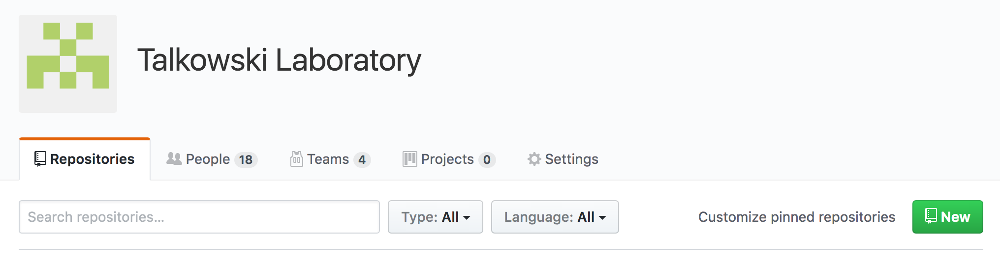
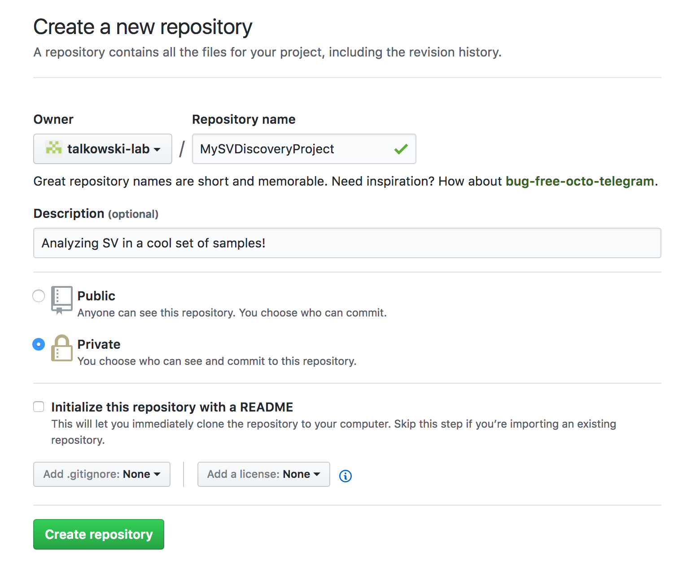
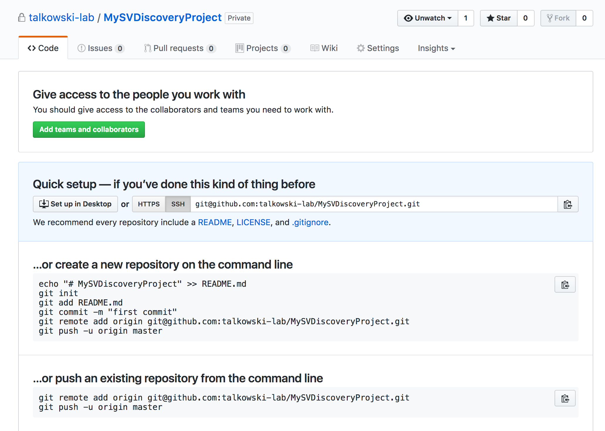

.. SV Pipeline installation and setup documentation
   Copyright (C) 2017 Matthew Stone <mstone5@mgh.harvard.edu>
   Distributed under terms of the MIT license.

========================
SV Pipeline installation
========================

The SV pipeline is provided as a collection of Snakemake_ workflows and
associated configuration files and helper scripts. 

For deployment on a new project or set of samples, you should follow the
process outlined in Snakemake's `deployment documentation`_, i.e., clone the
pipeline, edit the configuration files as necessary, and run each module's
Snakefile.  (A master workflow sequentially running each module is under
development. We recommend that you create a new git repository to track your
project, and sync any project-specific changes to it. See `Installation for
deployment`_ for details.

To contribute to the pipeline's development, please follow the directions in
`Installation for development`_ and keep this copy of the repository
independent of any analyses.

Installation for deployment
===========================

Download the pipeline
~~~~~~~~~~~~~~~~~~~~~
First, clone the master pipeline repository to a local directory. This will
download all the scripts, Snakefiles, and configuration files necessary to run
the pipeline.

.. code-block:: bash

   $ git clone git@github.com:talkowski-lab/sv-pipeline.git MySVDiscoveryProject
   $ cd MySVDiscoveryProject

Create a project-specific repo
~~~~~~~~~~~~~~~~~~~~~~~~~~~~~~
Next, set up a git repository to track the new project. Go to your user or 
organization page (e.g. github.com/talkowski-lab) and click the "New" button.

Fill in the details for the new repository, naming it after the new project.
You can optionally add a description, but don't initialize it with a README.
Click "Create repository" when you're finished.

Now you'll see the usual GitHub instructions for setting up a new repo, but we
don't want to follow them quite yet.

Set up remotes
~~~~~~~~~~~~~~
Our local copy of the pipeline is already a git repository, so we can't just
follow the directions for a brand new repo. Instead of pushing the changes we
make to the master pipeline repo, we want to update our local copy to store any
project-specific changes in the repository we just created. To do so, we're
going to take advantage of what git calls *remotes*. Remotes are simply
remotely hosted repos that we can sync our local copy with. Usually, this is
just the repository we cloned from.

By default, ``git push`` and ``git pull`` sync with a remote named
``origin``. When you clone a repository, ``origin`` is set to the address you
cloned from. Here, that means ``origin`` is the master pipeline repo, which you
can see here.

.. code-block:: bash
   
   # From inside the MySVDiscoveryProject directory
   $ git remote -v
   origin	git@github.com:talkowski-lab/sv-pipeline.git (fetch)
   origin	git@github.com:talkowski-lab/sv-pipeline.git (push)

This is telling us that when we run ``git push`` or ``git pull``, we'll be
pushing to or pulling from the ``talkowski-lab/sv-pipeline`` repo. We want to
instead push to and pull from the repository we just created. However, we don't
want to totally forget about the master pipeline repo, since we want to still
be able to get any improvements or bugfixes that are added to it.

Instead of simply overwriting origin, we'll first rename the
``talkowski-lab/sv-pipeline`` remote to something else. We'll call it
``upstream`` since its codebase will remain upstream of any project-specific
changes we make.

.. code-block:: bash

   $ git remote rename origin upstream

Then, we'll add the repo we just created as our new ``origin``, and tell git
to push to it by default.

.. code-block:: bash

   $ git remote add origin git@github.com:talkowski-lab/MySVDiscoveryProject.git
   $ git push -u origin master

Success! Our local repository is now aware of two remote repos -- the upstream
master pipeline repo, and the repo we just created to track our project. 

.. code-block:: bash

   $ git remote -v
   origin	git@github.com:talkowski-lab/MySVDiscoveryProject.git (fetch)
   origin	git@github.com:talkowski-lab/MySVDiscoveryProject.git (push)
   upstream	git@github.com:talkowski-lab/sv-pipeline.git (fetch)
   upstream	git@github.com:talkowski-lab/sv-pipeline.git (push)

Why go through this trouble? Well, we want to be able to track any changes we
make that are specific to this project, like configuration values or custom
scripts. We don't want to put *everything* the lab ever does in the master
pipeline repo. It'll become unwieldy to manage, and we might want to keep some
projects private until they're published, which we wouldn't be able to do if
they lived inside the public pipeline repo. We also want to be able to
integrate any major changes made to the pipeline, such as bug fixes or new
features, to any analyses relying on the pipeline. We can accomplish both of
these goals by setting up a new repo for each project, managing them
independently from the pipeline development, but keeping the ability to pull in
changes from the master pipeline on demand.

**NOTE:** The ``.gitignore`` files provided with the pipeline are intended to
be fairly comprehensive, but be careful not to commit and try to push large
data files to your project's repo.

Installation for development
============================

If you'd like to work on the pipeline, clone the repository to a local
directory.

.. code-block:: bash

   $ git clone git@github.com:talkowski-lab/sv-pipeline.git
   $ cd sv-pipeline

Create a new branch for the feature or bugfix you're interested in developing,
and plug away!

.. code-block:: bash
   
   $ git checkout -b my-new-feature

**NOTE:** Do not push analysis-specific changes to the master pipeline repo.

.. _Snakemake: https://snakemake.readthedocs.io/en/stable/
.. _`deployment documentation`: https://snakemake.readthedocs.io/en/stable/snakefiles/deployment.htmla
